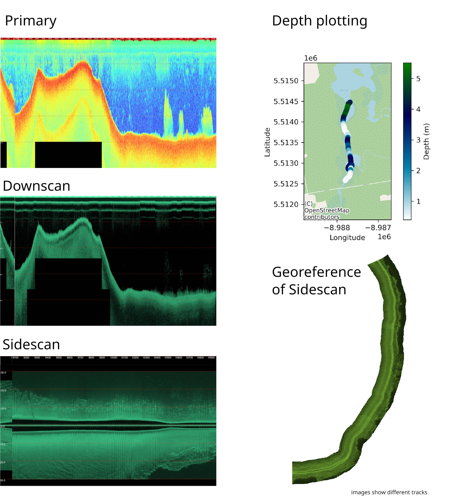
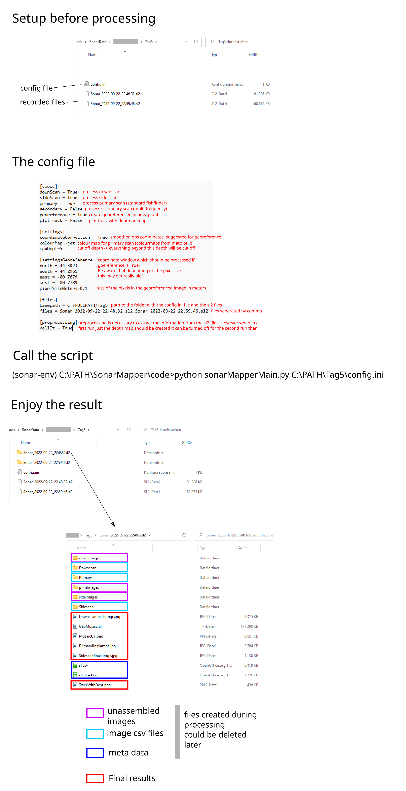
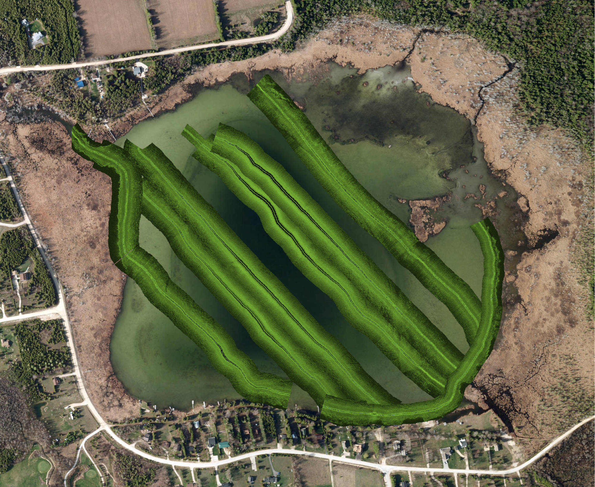

# **SonarMapper**
Python scripts to process and visualize sonar data from Lowrance Fishfinders

We like kayaking and always wondered what is underneath the hull. Combined with a general interest in mapping we got
a fishfinder from Lowrance. However looking at recorded data on the device afterwards is not a pleasure and Lowrance
doesn't deliver any free software to process the files on a PC in high resolution.
Therefore we created these scripts to process and visualize the data from the fishfinder created sl2 files.

Currently supported functions:
- read sl2 file into csv files (meta ink. position information and image information)
- create down scan and primary scan images
- create side scan images
- create plot of the track with depth information
- georeference the side scan data and export as Geotiff

The first part of reading the sl2 file is based on a library from KennethTM (https://github.com/KennethTM/sonaR). 
However this library is set in R which means that an installation of R is required.

**If you need more information to get started check the videos:**  
Installation: https://www.youtube.com/watch?v=3kaIQv3jeYc  
How To: https://www.youtube.com/watch?v=RMYd-Z57woo  

# Installation information for Windows  
**install R and Rtools**  
https://cran.r-project.org/bin/windows/base/  
https://cran.r-project.org/bin/windows/Rtools/  

**open R and run in the R terminal**  
_install.packages("remotes")_  
_install.packages("glue")_  

_library(remotes)_  
_remotes::install_github('KennethTM/sonaR')_  

**check Rscript path**  
in code/sonarMapperMain.py check the path to Rscript, since it depends on your installed version  
_pathToR='"C:/Program Files/R/R-4.2.1/bin/x64/Rscript.exe"'_  

**install conda**  
https://www.anaconda.com/products/distribution

**create environment in conda from yaml**
cd to the folder containing the yaml file

_conda env create -f environment.yaml_

activate the new environment
_conda activate sonar-env_

# Installation hint for Ubuntu
I added some changes to the code as comments that need to be applied for Ubuntu. 
However I didn't invest much time in it and had issues with the GDAL library, which effects the track plotting and georeference.

# How to run it #  
activate the python enviroment  
__conda activate sonar-env__  

Create a folder for your trip files. (for example "Tag5")
Now copy your .sl2 files to this folder.
Adapt the config to your current project.
- it needs to point to the sl2 file folder and the file name of all sl2 files you wish to process separated by commas (use / here not the windows backslash)  
_config.ini_

**run it with the created config :-) (example path)**  
_(sonar-env) C:\PATH\SonarMapper\code>python sonarMapperMain.py C:\PATH\Tag5\config.ini_

**the area for georeference can be selected for example via openstreetmap**
https://www.openstreetmap.org/export

# Add Ons
(1) Some of the processes take a lot of RAM. So try to make as much free as possible, depending on the size of your file.  
(2) The georeferencing takes quite some time to process  
(3) The georeferenced images can be loaded for example to QGIS to assemble them 

# Example for the usage of georeferenced images  
Several images that are georeferenced can be put together on a map by for example using QGIS

